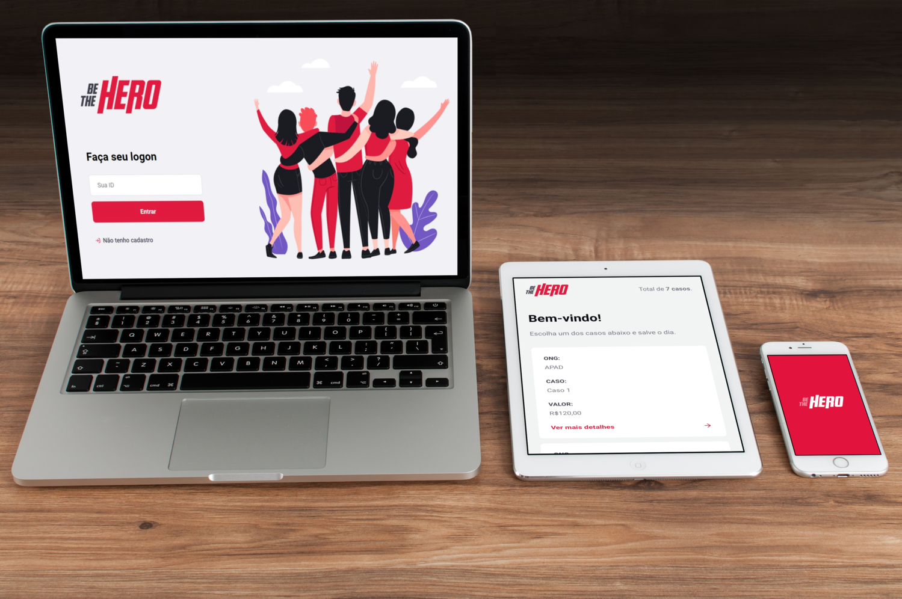

<h1 align="center">
    
</h1>

<h4 align="center"> 
# be-the-hero | ⚠ under development (em desenvolvimento).
💻 an application made with node.js | react &amp; react native ⚛ from the omnistack week 11 by @rocketseat 🚀
</h4>

<h1 align="center">

 
  
</h1>

<h1 align="center">
    
</h1>

## 🚀 developed with
#### these core technologies ⚛

- [Node.js](https://nodejs.org/en/) 
- [React](https://reactjs.org)
- [React Native](https://facebook.github.io/react-native/)
- [Expo](https://expo.io/)

## ✔ made also with:
#### couldn't have done it without these 💜

- **dependencies** 
		celebrate	"^12.0.1" 
		cors	"^2.8.5" 
		cross-env	"^7.0.2" 
		express	"^4.17.1" 
		knex	"^0.20.13" 
		sqlite3	"^4.1.1" 
- **devDependencies** 
		jest	"^25.2.3" 
		nodemon	"^2.0.2" 
		supertest	"^4.0.2" 
    
   ---------------------------------------
    
    
     ######   a special thanks to [rocketseat](https://www.rocketseat.com.br) | made with ❤ and ☕ for you!
    
    
